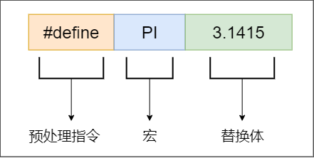

# 预处理指令之define

\#define 指令是再学习C语言时接触的第二个预处理指令，他的基本用法很简单，但是进阶使用却可以实现很多复杂的功能，正是如此，也容易掉入坑里~

## 一、 define的基本用法
define的最简单用法就是宏替换，将一个宏替换为指定的替换体。
```c
#define PI 3.1415
```
这个语句的会将文件中出现的PI（全字匹配,且不在字符串中）替换为3.1415。例如下面的语句：
```c
printf("PI is %f\n",PI);

//输出结果为：PI is 3.1415
```
第一个PI由于在字符串中，所有不会被替换，第二个PI被当成一个常量替换为3.1415。

## define 替换规则
define进行替换时分为两大类：**类对象宏**和**类函数宏**。

在上面使用例子中使用的就是类对象宏。其结构如下：


类对象的由三部分组成：预处理指令#define 、宏名和替换体。

在宏的名称中不能出现空格，必须为连续的整体，除了预处理指令和宏以外都为替换体。

类函数宏的结构如下：


